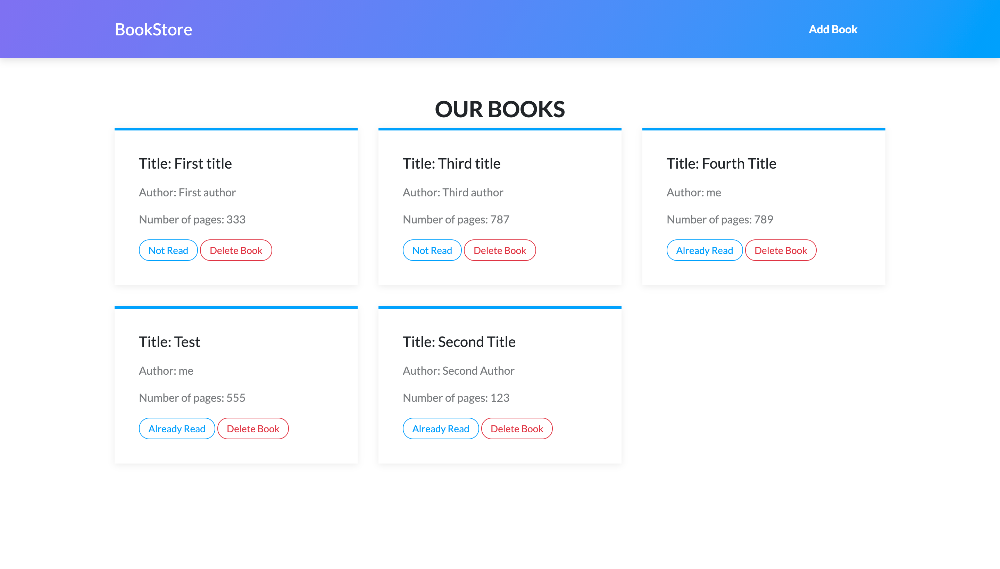

# JavaScript Project - Library App 

>  In this project I built a small JS app to keep track of read books, the user can enter books with its title, author number of pages and wether if the book is alreadey read or not, the user can also delete books from the inventory.
## Screenshot

## Built With

- JavaScript
- Bootstrap
- Firebase
- VSCode

## Live Demo

http://torresbribiesca.tech/Bookstore-JS/

## Author:

### 👨‍💻 Jorge Torres

- Github: [Jorge Torres](https://github.com/Yors-git)
- Linkedin: [Jorge Torres](https://www.linkedin.com/in/jtbribiesca/)
- Twitter: [@Yors_82](https://twitter.com/Yors_82)

## 🤝 Contributing

Contributions, issues and feature requests are welcome!

Feel free to check the [issues page](https://github.com/Yors-git/food-social-network/issues).

## Show your support

Give a ⭐️ if you like this project!

## 📝 License

This is a Microverse project, all rights reserved to Jorge Torres
